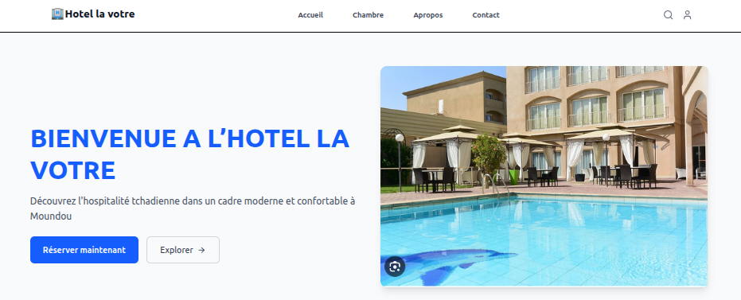

# Site de Réservation d'Hôtels - Frontend

## Description

Application web moderne pour la réservation d'hôtels, développée avec React, TypeScript, Vite et Tailwind CSS.  
Le projet est organisé selon une architecture modulaire avec une séparation claire des responsabilités.

## Fonctionnalités principales

- Page d'accueil dynamique avec sections Hero et Features
- Tableau de bord utilisateur avec sidebar et widgets statistiques
- Design responsive et accessible mobile-first
- Composants réutilisables et typés avec TypeScript
- Utilisation des icônes Lucide React

##   Capture d'écran de la page d’accueil

## Technologies utilisées

 # Outils & Frameworks
.React – Librairie pour interfaces interactives

.TypeScript – Langage avec typage statique

.Vite – Bundler rapide moderne

.Tailwind CSS – Framework CSS utilitaire

# Design & UI
.Lucide React – Icônes SVG modernes

.Landingfolio – Exemples de landing pages

.Tuk.dev – Composants Tailwind CSS

.TailwindReady – UI kits gratuits

# Installation & lancement
# 1. Cloner le projet
git clone https://github.com/moustaphachogardinga/hotel-reservation.git
cd hotel-reservation
# 2. Accéder au dossier
cd hotel-reservation
# 3.Installer les dépendances
npm install
# 4.Lancer le serveur de développement
npm run dev
- L’application démarre sans erreur à http://localhost:5173
## Structure du projet
src/
├── components/
# Composants réutilisables
│ ├── Header.tsx
# Navigation principale
│ ├── Hero.tsx
# Section héro
│ ├── Features.tsx # Section fonctionnalités
│ ├── Sidebar.tsx # Barre latérale
│ └── Footer.tsx # Pied de page
├── layouts/
# Layouts de page
│ ├── MainLayout.tsx # Layout principal (Header + Footer)
│ └── SidebarLayout.tsx # Layout avec sidebar
├── pages/
# Pages de l'application│ └── Dashboard.tsx # Page tableau de bord
└── App.tsx
# Composant racine